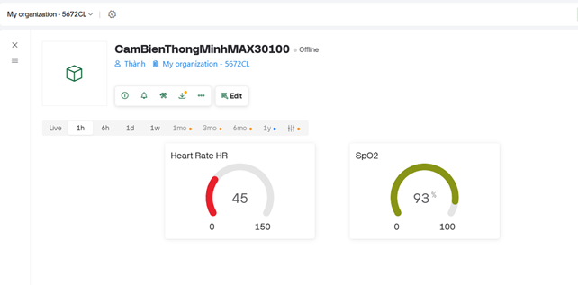

# Smart Sleep Tracking Classification Device

## Description

This project is a smart sleep monitoring system that uses the MAX30100 pulse oximeter sensor to track vital health parameters during sleep. The device continuously monitors and records:

- **Heart Rate (HR)** - Measured in beats per minute (bpm)
- **Blood Oxygen Saturation (SpO2)** - Measured as a percentage

The system is built on an ESP8266 microcontroller and features:
- Real-time data display on an OLED screen (SSD1306)
- Cloud connectivity via Blynk IoT platform for remote monitoring
- Automatic data logging to Google Sheets for analysis and classification
- WiFi connectivity for seamless data transmission

The device sends data to Google Sheets every 10 seconds and updates the Blynk dashboard every second, enabling comprehensive sleep tracking and health monitoring. This data can be used to classify sleep patterns and detect potential health issues during sleep.

### System Overview


*Images showing the entire system in operation*

### Hardware Circuit


*Real actual circuit diagram*

### Blynk Cloud Dashboard



*BPM and SpO2 oscillator chart on the Blynk cloud*

### Sleep Classification Data


*Sleep classification statistics table in Google Sheet*


*Sleep classification statistics table in Google Sheet (continued)*


*Sleep classification statistics table in Google Sheet (analysis)*

## Authors

- **Trinh Cong Thanh** - [GitHub Profile](https://github.com/Bomoursenfant)

## Usage

### Hardware Requirements

- ESP8266 development board (NodeMCU or similar)
- MAX30100 Pulse Oximeter and Heart Rate Sensor
- SSD1306 OLED Display (128x64)
- Connecting wires
- USB cable for programming and power

### Software Requirements

- Arduino IDE with ESP8266 board support
- Required Arduino Libraries:
  - `MAX30100_PulseOximeter`
  - `Adafruit_GFX`
  - `Adafruit_SSD1306`
  - `ESP8266WiFi`
  - `BlynkSimpleEsp8266`
  - `Wire`

### Installation

1. **Clone the repository:**
   ```bash
   git clone https://github.com/Bomoursenfant/smart-sleep-tracking-classification-device.git
   cd smart-sleep-tracking-classification-device
   ```

2. **Install Arduino Libraries:**
   - Open Arduino IDE
   - Go to Sketch → Include Library → Manage Libraries
   - Search and install all required libraries listed above

3. **Configure the Arduino Sketch:**
   
   Open `MAX30100.ino` and update the following credentials:
   
   ```cpp
   #define BLYNK_TEMPLATE_ID "YOUR_TEMPLATE_ID"
   #define BLYNK_AUTH_TOKEN "YOUR_BLYNK_TOKEN"
   
   char ssid[] = "YOUR_WIFI_NAME";
   char pass[] = "YOUR_WIFI_PASSWORD";
   
   String GAS_ID = "YOUR_GOOGLE_SCRIPT_ID";
   ```

4. **Setup Google Sheets:**
   
   - Create a new Google Sheet
   - Go to Extensions → Apps Script
   - Copy the contents of `ScriptGoogleSheet_MAX30100.js` into the script editor
   - Update the `sheet_id` variable with your Google Sheet ID
   - Deploy as Web App (Execute as: Me, Who has access: Anyone)
   - Copy the deployment ID and use it as `GAS_ID` in the Arduino code

5. **Setup Blynk:**
   
   - Create a new Blynk account at [Blynk.io](https://blynk.io/)
   - Create a new template and device
   - Add two datastreams:
     - V0 (Virtual Pin 0) for Heart Rate
     - V1 (Virtual Pin 1) for SpO2
   - Copy your Template ID and Auth Token to the Arduino code

6. **Hardware Connections:**
   
   Connect the components as follows:
   
   | Component | ESP8266 Pin |
   |-----------|-------------|
   | MAX30100 SDA | D2 (GPIO4) |
   | MAX30100 SCL | D1 (GPIO5) |
   | OLED SDA | D2 (GPIO4) |
   | OLED SCL | D1 (GPIO5) |
   | VCC (Both) | 3.3V |
   | GND (Both) | GND |

7. **Upload the Code:**
   
   - Connect your ESP8266 to your computer via USB
   - Select the correct board and port in Arduino IDE
   - Click Upload

### Operation

1. **Power On:**
   - Once powered, the device will display "Initializing..." on the OLED screen
   - It will connect to WiFi and initialize the MAX30100 sensor
   - If successful, you'll see "MAX30100 SUCCESS"

2. **Sensor Placement:**
   - Place your finger on the MAX30100 sensor
   - Make sure your finger covers both the LED and photodetector
   - Keep your hand steady for accurate readings

3. **Monitor Data:**
   - View real-time readings on the OLED display
   - Access the Blynk mobile app to see live data remotely
   - Check Google Sheets for historical data logs with timestamps

4. **Data Analysis:**
   - The Google Sheet will contain columns for:
     - Date
     - Time
     - Heart Rate (bpm)
     - SpO2 (%)
   - Use this data to analyze sleep patterns and detect anomalies

### Troubleshooting

- **MAX30100 FAILED:** Check I2C connections and ensure the sensor is properly powered
- **No WiFi Connection:** Verify SSID and password are correct
- **No Data in Google Sheets:** Ensure the Google Apps Script is deployed as a web app and the GAS_ID is correct
- **Blynk Not Updating:** Check your Blynk auth token and ensure the device is online in the Blynk console

### Configuration

You can adjust the following parameters in `MAX30100.ino`:

- `REPORTING_PERIOD_MS` (default: 1000ms) - Update frequency for display and Blynk
- `GOOGLE_SHEET_PERIOD_MS` (default: 10000ms) - How often to send data to Google Sheets
- `MAX30100_LED_CURR_7_6MA` - LED current intensity for the sensor

## License

This project is open source and available for educational and personal use.

## Acknowledgments

- MAX30100 library by OXullo
- Adafruit for the excellent GFX and SSD1306 libraries
- Blynk team for their IoT platform
